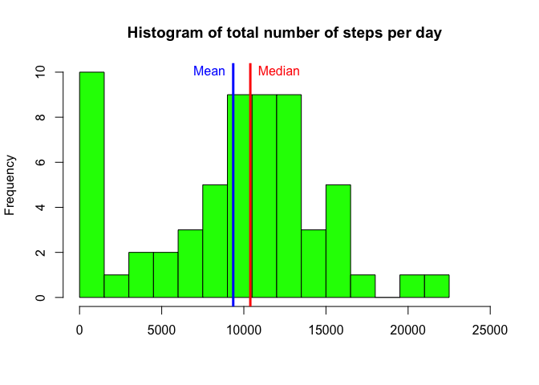
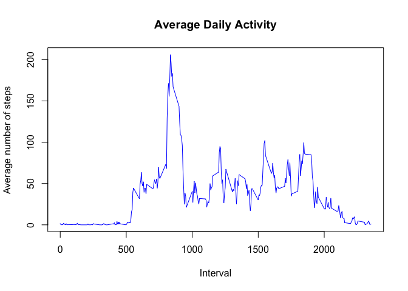
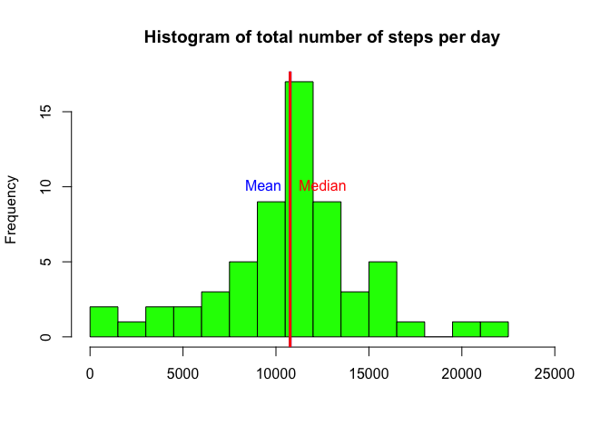
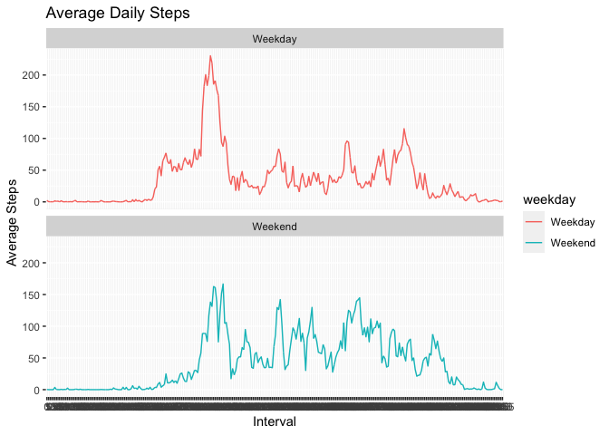

## Loading and preprocessing the data
First, we load the data:

```r
setwd("/Users/rodrigo/Documents/R/Data Science/Reproducible Research")
if (dir.exists("FirstAssignment")==FALSE){
        dir.create("FirstAssignment")
        setwd("./FirstAssignment")
        download.file("https://d396qusza40orc.cloudfront.net/repdata%2Fdata%2Factivity.zip",
                      destfile = "data.zip", method = "curl")
        unzip("data.zip")
}
setwd("./FirstAssignment")
activity<-read.csv("activity.csv")
activity$date<-as.Date(activity$date,format = "%Y-%m-%d")
activity$interval<-factor(activity$interval)
```

## What is mean total number of steps taken per day?
This is the histogram of the total number of steps taken each day.

```r
steps <- tapply(activity$steps,activity$date,sum,na.rm=TRUE)
hist(steps, breaks = seq(0,22500,by=1500),col="green",
     main = "Histogram of total number of steps per day", xlab = "",
     xlim = c(0,25000))
abline(v=mean(steps),col="blue",lwd=3)
text(mean(steps),10,"Mean",col="blue",pos=2)
abline(v=median(steps),col="red",lwd=3)
text(median(steps),10,"Median",col="red",pos=4)
```

<!-- -->

And here we have the mean and the median number of steps taken per day.

```r
summary(steps)[c(3,4)]
```

```
##   Median     Mean 
## 10395.00  9354.23
```

## What is the average daily activity pattern?
This is the time series plot of the average number of steps taken

```r
steps <- tapply(activity$steps,activity$interval,mean,na.rm=TRUE)
plot(levels(activity$interval),steps,type="l", main = "Average Daily Activity",
     ylab = "Average number of steps", xlab = "Interval", col= "blue")
```

<!-- -->

This is the 5-minute interval that, on average, contains the maximum number of steps

```r
steps[which.max(steps)]
```

```
##      835 
## 206.1698
```

## Imputing missing values
First, we report the total number of missing values in the dataset and undertake a strategy for imputing missing data. Namely, my strategy will consist on substitute NA values with the average value for that 5-minute interval.

```r
sum(!complete.cases(activity))
```

```
## [1] 2304
```

```r
newact<-activity
for (a in 1:dim(newact)[1]){
        if (is.na(newact[a,"steps"])==TRUE){
                b<-newact[a,"interval"]
                newact[a,"steps"] <- as.integer(round(steps[b]))
        }
}
rm(a,b)
```
Then, let's plot the histogram of the total number of steps taken each day after missing values are imputed.

```r
steps <- tapply(newact$steps,newact$date,sum)
hist(steps, breaks = seq(0,22500,by=1500),col="green",
     main = "Histogram of total number of steps per day", xlab = "",
     xlim = c(0,25000))
abline(v=mean(steps),col="blue",lwd=3)
text(mean(steps),10,"Mean",col="blue",pos=2)
abline(v=median(steps),col="red",lwd=3)
text(median(steps),10,"Median",col="red",pos=4)
```

<!-- -->

The histogram is now very similar to the one of a normal distribution. This is likewise reflected on the median and mean values:

```r
summary(steps)[c(3,4)]
```

```
##   Median     Mean 
## 10762.00 10765.64
```

## Are there differences in activity patterns between weekdays and weekends?
Firstly, I create the dummy variable and prepare the data for the plot.

```r
newact$weekday <- factor(ifelse(weekdays(newact$date) %in% c("Saturday","Sunday"),
                         "Weekend","Weekday"))
steps <- data.frame(t(tapply(newact$steps,list(newact$weekday,newact$interval),mean)))
steps$interval <- rownames(steps)
library(tidyr)
steps <- pivot_longer(steps,-interval,names_to = "weekday", values_to = "avgsteps")
newact <- merge(newact,steps,by=c("weekday","interval"))
```
Then, let'see a panel plot comparing the average number of steps taken per 5-minute interval across weekdays and weekends.

```r
library(ggplot2)
ggplot(data = newact,aes(interval,avgsteps,group=weekday,color=weekday))+
        geom_line()+facet_wrap(weekday~.,nrow=2)+ggtitle("Average Daily Steps")+
        ylab("Average Steps")+xlab("Interval")
```

<!-- -->
